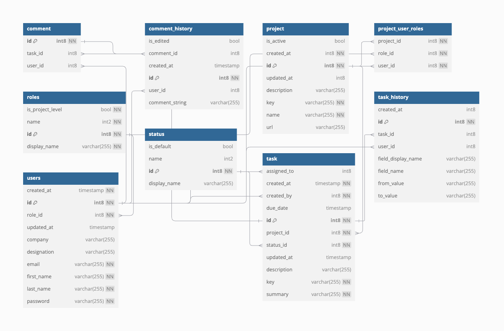

# Task Management App


A Spring Boot-based Task Management App designed for managing projects, tasks, users, comments, and task history. This application supports JWT-based authentication and provides a structured REST API for efficient project and task management.

---

## Table of Contents
1. [Features](#features)
2. [Technologies Used](#technologies-used)
3. [Architecture Overview](#architecture-overview)
4. [Prerequisites](#prerequisites)
5. [Installation](#installation)
6. [Database Setup](#database-setup)
7. [Configuration](#configuration)
8. [Running the Application](#running-the-application)
9. [Database Schema](#database-schema)
10. [API Endpoints](#api-endpoints)
11. [Contributing](#contributing)
12. [License](#license)

---

### Features
- **Project and Task Management**: Manage multiple projects and tasks with details.
- **Role-based Access Control**: Supports both application-level and project-level roles.
- **JWT Authentication**: Secure API endpoints with JWT token-based authentication.
- **Task Commenting and History Tracking**: Store comments and status changes with complete histories.
- **Spring Boot REST API**: Simplified and well-structured API for core functionalities.

---

### Technologies Used
- **Backend**: Java, Spring Boot, Spring Security, JPA/Hibernate
- **Database**: PostgreSQL
- **Token Authentication**: JWT
- **Other**: Lombok, Maven, Swagger for API Documentation

---

### Architecture Overview
The application follows a layered architecture:
- **Controller Layer**: Handles HTTP requests and responses.
- **Service Layer**: Contains business logic.
- **Repository Layer**: Interfaces to interact with the database.
- **Entities**: Defines project, task, user, comment, and role relationships using JPA annotations.

---

### Prerequisites
- **Java 11** or higher
- **PostgreSQL** (or use **H2** for testing)
- **Maven** (for dependency management and builds)

---

### Configuration
- **Edit src/main/resources/application.properties with the following configurations:**:
   ```bash
   # Database Config
    spring.datasource.url=jdbc:postgresql://localhost:5432/task_management_db
    spring.datasource.username=taskuser
    spring.datasource.password=your_password

    # JWT Config
    security.jwt.secret=your_secret_key
    security.jwt.expiration=86400000  # 24 hours

    # CORS
    security.cors.allowed-origins=http://localhost:3000
    
    # H2 Console (if using H2 for testing)
    spring.h2.console.enabled=true
    spring.h2.console.path=/h2-console
    ```
## Database Schema

Here's an overview of the main tables and their relationships in the Task Management App:

- **User**: Stores user details and roles.
    - Fields: `id`, `username`, `email`, `password`, `roles`
    - Relationships: One-to-many with **Task** (creator and assignee)

- **Project**: Holds project metadata.
    - Fields: `id`, `name`, `description`, `created_by`, `created_at`, `updated_at`
    - Relationships: One-to-many with **Task**

- **Task**: Each task is associated with a single project.
    - Fields: `id`, `title`, `description`, `status`, `created_by`, `assigned_to`, `project_id`, `created_at`, `updated_at`
    - Relationships:
        - Many-to-one with **Project**
        - Many-to-one with **User** (for created by and assigned to)
        - One-to-many with **Comments**
        - One-to-many with **TaskHistory**

- **Comments**: Stores task comments and links to **CommentHistory** for edit tracking.
    - Fields: `id`, `task_id`, `user_id`, `comment_text`, `created_at`, `updated_at`
    - Relationships:
        - Many-to-one with **Task**
        - Many-to-one with **User**
        - One-to-many with **CommentHistory**

- **CommentHistory**: Tracks edits made to comments.
    - Fields: `id`, `comment_id`, `edited_by`, `comment_text`, `edited_at`
    - Relationships: Many-to-one with **Comments**

- **TaskHistory**: Tracks changes made to the task status and other modifications.
    - Fields: `id`, `task_id`, `status`, `changed_by`, `changed_at`
    - Relationships: Many-to-one with **Task**

- **Role**: Defines roles at both application and project levels.
    - Fields: `id`, `name`
    - Relationships: Many-to-many with **User**

For a detailed schema diagram, refer below



## API Documentation

This project includes API documentation with Swagger. You can access the interactive Swagger UI at the following endpoint:

- **Swagger UI**: [http://localhost:8080/swagger-ui/index.html](http://localhost:8080/swagger-ui/index.html)

Use this UI to explore all available API endpoints, request parameters, and response formats.

